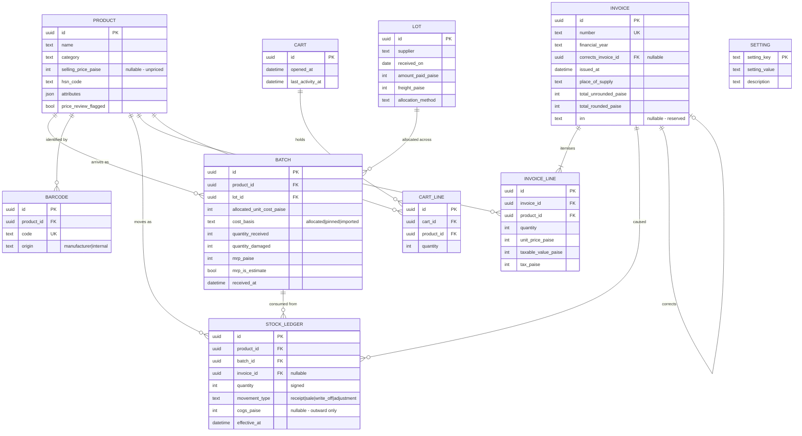

## Context

bahi-khaata is a new project, built from scratch. There is no existing system to interoperate with, no legacy data to carry forward, and no users whose workflow constrains the design. That freedom is the reason to be careful rather than a licence to be casual: these decisions are unusually cheap to make now and unusually expensive to revisit, because once real invoices exist the schema underneath them is effectively frozen by GST law and by the audit trail it has to preserve.

Three decisions were taken during proposal discussion and are treated as settled here: the backend owns the database and the terminal is a localhost HTTP client; the repository is a Gradle multi-project build; and data access is Hibernate/JPA. This document records why, what was rejected, and — more importantly — the consequences those choices create that have to be designed around rather than discovered later.

The binding constraint throughout is that every line is reviewed by one engineer before it ships. A design that is subtly clever is worse here than one that is obviously correct, because the review is the only quality gate the project has.

## Goals / Non-Goals

**Goals:**

- A schema whose invariants — append-only ledger, immutable invoices, cost separate from price — are enforced by the database, not merely by convention in application code.
- Module boundaries enforced by the build, so detaching a module later is a configuration change rather than an untangling exercise.
- Exact money arithmetic, with no path by which a rounding artefact can reach an invoice.
- A schema version that is a knowable number on every install, never an accident of history.
- A local development and self-hosting path that works from a clean checkout without manual database steps.
- One sale driven end to end through every layer, proving the decisions above under real load rather than on paper.

**Non-Goals:**

- Any flow beyond the single vertical slice. No returns, held sales, discounts, tender, label generation, reporting, or error recovery.
- Printing of any kind. Invoices render on screen; TSPL and ESC/POS integration is the thinnest-documented work in the project and would dominate this change.
- Visual polish. The terminal screens are expected to look rough, and that is not a defect to be fixed here.
- The dashboard beyond an empty module.
- Multi-outlet sync, IRP/e-invoicing integration, payment gateway integration, price-comparison, digital shelf labels. Schema leaves room where noted; nothing is built.
- Performance tuning. At a few thousand SKUs and one terminal, correctness dominates and premature optimisation would only obscure review.

## Decisions

### 1. Gradle multi-project with four modules

`contracts`, `backend`, `terminal`, `dashboard`, with a root build defining shared configuration. Dependency edges are declared explicitly: `terminal → contracts`, `backend → contracts`, `dashboard → contracts`. Notably absent is `terminal → backend`, which is the whole point.

`contracts` holds request/response DTOs and nothing else — no JPA entities, no Spring types, no persistence annotations. If a JPA entity ever appears in `contracts`, the persistence model has leaked into the wire format and every future schema change becomes a breaking API change.

*Considered and rejected:* plain directories with independent builds, which was the initial instinct. Rejected because a directory boundary is only a suggestion — nothing stops an import, and by the time the violation is noticed it is load-bearing. Also rejected: separate repositories from the start, which imposes cross-repo version coordination on a solo developer for a benefit that does not exist until there is a second contributor.

*Enforcement:* ArchUnit tests in the root build fail on any package-level dependency that crosses a boundary not declared above. Detachability that is not tested is detachability that will quietly stop being true.

### 2. Backend owns SQLite; terminal is a localhost client

Only `backend` holds a JDBC connection. The terminal performs every read and write over HTTP to `127.0.0.1`.

*Considered and rejected:* the terminal opening SQLite directly, with the backend serving the dashboard only. Rejected because business logic — FIFO consumption, tax calculation, invoice numbering — would then exist in two places or migrate into the terminal, contradicting the report's "one source of truth" and making the eventual server move a rewrite of the terminal rather than a change of base URL.

*Consequence that must be designed for:* the counter PC now runs two processes, and the terminal can start before the backend is listening. This is not an edge case; it is a cold Monday morning. The terminal must, on startup, poll the backend health endpoint with a visible, plain-language waiting state, and must not present a checkout screen until the backend answers. A cashier seeing "Starting up — one moment" is a non-event; a cashier seeing a stack trace or a frozen window will reach for the old process and stop trusting the system. Installation therefore registers the backend as an OS-level service that starts at boot, with the terminal's polling as the safety net rather than the primary mechanism.

### 3. Hibernate/JPA, with `ddl-auto=validate`

Hibernate never modifies the schema. It validates that the schema it finds matches its entity mappings and refuses to start if not.

*Considered and rejected:* `ddl-auto=update`, the tempting default. It cannot drop or rename columns, cannot transform data, and leaves no record of what any given install actually applied — which is precisely the drift that killed Chromis POS. `create-drop` is a development-only footgun in a system holding financial records and is not configured in any profile.

*Considered and rejected:* jOOQ, which was genuinely the better technical fit for hand-written FIFO and valuation queries and would have produced more reviewable SQL. Rejected in favour of the reviewer's fluency: correctness here depends on the engineer catching subtle bugs, and that ability is highest in the stack they know best. The mitigations in decision 5 exist specifically to recover what jOOQ would have given for free.

*Known risk, since resolved:* Hibernate's SQLite support lives in `hibernate-community-dialects` and is community-maintained rather than first-class. The spike in task 1.1 exercised JSON mapping, integer-paise persistence, `@Immutable`, and Flyway-then-validate startup against Spring Boot 3.5 with `sqlite-jdbc`, and all four hold. The ORM decision stands.

*Consequence for every migration:* the validator compares *declared* column types, not SQLite's runtime affinity, so migration DDL must spell types the way the dialect expects even where SQLite itself does not care:

- a column backing a Java `long` must be declared `BIGINT`, never `INTEGER` — this covers every paise column and every quantity in the schema;
- a column backing `@JdbcTypeCode(SqlTypes.JSON)` must be declared `CLOB`, not `TEXT`;
- a column backing a `UUID` field mapped `@JdbcTypeCode(SqlTypes.CHAR)` must be declared `CHAR(36)`, not `TEXT` — found during task 1.7, same failure mode.

Both were found by the spike failing, which is what it was for. Getting either wrong does not corrupt data — it prevents the application starting at all, loudly and at the right moment.

### 4. Flyway, with plain SQL migrations

Versioned `V<n>__description.sql` files under `backend`, applied automatically at startup, tracked in Flyway's own history table.

*Considered and rejected:* Liquibase. It is more capable and genuinely better at database-agnostic changelogs, which matters for the future Postgres move. Rejected anyway because its XML/YAML changelog format is the exact artefact that made Chromis POS's migrations unreviewable and drift-prone, and because plain SQL is the format this project's reviewer can audit fastest. When the Postgres migration arrives it will be a deliberate, one-time schema translation, not a continuous dual-dialect burden — paying an abstraction cost every day to make one future day easier is the wrong trade.

*Consequence:* migrations are forward-only. There are no `down` scripts. Rolling back a bad migration on a single-outlet install means restoring the nightly database backup, which is simpler and more honest than maintaining reverse scripts that are never exercised and therefore never known to work.

### 5. Immutability enforced at both layers

Ledger rows and issued invoices are immutable. This is enforced twice:

- **Application layer:** entities are annotated `@Immutable`, expose no setters, and are constructed complete. This stops Hibernate's dirty-checking from ever generating an `UPDATE` — the specific hazard that JPA introduces and jOOQ would not have.
- **Database layer:** SQLite triggers raise on `UPDATE` or `DELETE` against `stock_ledger` and against `invoice` rows whose status is issued.

Belt and braces is deliberate. The application guard is the one that gives a clear error during development; the database guard is the one that still holds when a future change, a migration script, or a direct `sqlite3` session gets it wrong. Report §3.4 calls for read-only at the database level, and an ORM annotation alone does not deliver that.

Corrections are new rows referencing the original, never edits. A backdated stock entry appends at its effective date and the ledger recalculates forward from that point; it never rewrites what is already there.

### 6. Money is stored as integer paise

All monetary values are `INTEGER` columns holding minor units, mapped to a small value type in Java rather than passed around as bare `long`.

*Considered and rejected:* `BigDecimal` over SQLite's `NUMERIC` affinity. SQLite has no true decimal type — it applies type affinity and can store a numeric value as an 8-byte float, so a `BigDecimal` round-trip can silently lose exactness. That risk is unacceptable in tax arithmetic. Rejected also: `double` anywhere in the money path, for the obvious reason.

Rounding to the nearest rupee under CGST Act §170 happens once, explicitly, at invoice finalisation — not incrementally as line items accumulate. Rounding early and repeatedly is how totals drift by a rupee and how a customer loses confidence in the counter. The unrounded computed value and the rounded invoice value are both persisted, so any discrepancy is auditable rather than reconstructed.

*Open:* the exact per-line versus per-invoice rounding sequence should be confirmed against a CA's reading before the tax engine is built — flagged in Open Questions and inherited from report §4.4.

### 7. UUIDv4 stored as TEXT

Primary keys are UUIDv4 stored as 36-character `TEXT`.

*Considered and rejected:* 16-byte `BLOB`, which is roughly half the storage and marginally faster to index. Rejected because at a few thousand SKUs neither difference is measurable, while readable identifiers make every debugging session, log line, and manual `sqlite3` query dramatically easier — and this project's constraint is review and diagnosis effort, not disk. The choice is also cleanly portable to Postgres's native `uuid` type later.

### 8. Category attributes as JSON, shared fields as columns

Fields every product has — SKU, barcode, name, category, selling price, HSN code — are real columns with real constraints. Category-specific fields live in a single JSON column, queried via SQLite's built-in JSON functions and mapped through Hibernate's JSON type support.

The line between them is drawn by one test: if the system enforces a rule about a field, or joins or filters on it in a core flow, it is a column. JSON is for attributes the system stores and displays but does not reason about. Serial numbers and warranty periods start in JSON; if warranty tracking later becomes a feature with its own rules, that field graduates to a column via a migration. This keeps the flexible part genuinely free-form rather than becoming a shadow schema with no constraints.

*Considered and rejected:* EAV and per-category tables, both already rejected in report §3.1 for reconstruction cost and schema churn respectively.

### 9. Timestamps in UTC; financial year is explicit

All timestamps stored UTC, rendered in IST at the edges. The Indian financial year runs 1 April to 31 March, and invoice numbering resets per financial year, so the financial year is a stored, explicit field on the invoice rather than something derived from the date at query time. Deriving it repeatedly is how a boundary bug produces a duplicate invoice number in April.

Invoice numbers must be consecutive with no gaps within a financial year, which means allocation happens inside the same transaction that finalises the invoice. With one terminal this is uncontended; the transactional boundary is specified now so that a second terminal does not turn it into a duplicate-number defect later.

### 9a. The shop name is Hindi, shown in Devanagari, with a bundled font

The shop is **बचत बाज़ार** (romanized *Bachat Baazar*). It is one Hindi name in two scripts — the Devanagari is the name, the romanization is the same name in Roman letters for logs, window titles, and anywhere Devanagari rendering is not guaranteed. Romanization cannot carry the nuqta on ज़, which is one reason customer-facing surfaces use Devanagari.

Noto Sans Devanagari (SIL OFL) is **bundled** in the terminal, not assumed present. A counter PC may have no Devanagari face installed, and a missing one renders the shop's own name as empty boxes — the worst first impression for a business whose name is its brand. Bundling makes the name identical on every machine. Font loading fails loudly at startup if the resource is absent, rather than falling back to a system font that may not exist.

*Verified:* `BrandingTest` confirms the font parses and that `canDisplayUpTo` covers the full name including the nuqta, and a JavaFX snapshot was rendered by hand to confirm real glyphs paint rather than tofu.

*Deferred, and flagged:* the decision to show the name **Devanagari-only on invoices** is recorded but not built — no invoice exists until section 6. A GST tax invoice is a legal document that a tax officer or auditor may need to read, so Devanagari-only there carries a real risk that a romanized line alongside would remove. To be revisited when invoicing is built.

### 10. Java 21 LTS

The toolchain targets Java 21 LTS across all modules, pinned via the Gradle toolchain block so the build does not depend on whatever JDK a contributor happens to have installed.

*Rationale:* 21 has the broadest library support of the current LTS releases, which matters most for the least-trodden parts of this stack — the community SQLite dialect, JavaFX packaging via `jpackage`, and any USB or serial library reached for when hardware integration arrives. A newer LTS would be defensible for a project with a more conventional dependency set; here the cost of being early shows up precisely where support is already thinnest.

### 11. Packaging and licensing

`jpackage` produces a native terminal installer bundling a trimmed JRE. The backend ships with a Dockerfile and Compose file so a self-hosting retailer runs one command. AGPL-3.0 text at the repository root, short headers in source files, and the license declared in the Gradle build.

### 12. Margin erosion is detected and flagged, never auto-repriced

Receiving stock at a cost that drops a product's gross margin by 5 percentage points or more against its previous batch cost flags that product for price review. The threshold is configuration, not a constant. The selling price does not move.

*Considered and rejected:* automatically adjusting the selling price to preserve margin. This was raised deliberately and is worth recording, because the reasoning is not obvious. Auto-repricing invalidates every printed sticker and bin card for that SKU the instant it fires, and §5.5 holds that the scanned price always wins over the printed one — so the customer reads ₹200 on the tag and is charged ₹230 while standing at the counter. For a store whose entire proposition is that its prices are trustworthy and beat online, that is the worst available place to lose the argument, and a cost spike could silently push a price above the online price being undercut. Liquidation sourcing is lumpy by nature; one expensive lot is noise, and repricing on it makes the customer absorb sourcing volatility.

*Considered and rejected:* withholding flagged stock from the shelf until it is repriced. Safer against loss, but it makes every pricing question urgent and leaves stock sitting in the back. FIFO already provides the breathing room — the expensive batch is not consumed until older, cheaper batches are exhausted, so a flagged product typically keeps selling at its old cost for days. The margin problem is pending rather than live, which is what makes deferred review affordable.

Flagged products therefore stay on the shelf at their existing price. Review happens at the end of a delivery rather than interrupting it, since stopping to deliberate midway through a sixty-item pallet is how goods-in becomes a chore that gets skipped.

*Departure from the report:* §3.3 is honoured in substance — the system flags rather than reprices — but the report leaves the flag toothless, and a flag nobody reads means quietly selling at a loss for a month. Fixing that gap properly means the review queue must be a real work surface, not a line in a daily report. That surface belongs to the goods-in change; this change persists the flag so the queue has something to show.

*Ambiguity resolved deliberately:* gross margin is (price − cost) ÷ price, not (price − cost) ÷ cost. The two diverge quickly and confusing them is a classic retail arithmetic bug, so it is stated in the spec rather than left to the implementation.

### 13. Lots sit above batches, and per-product cost is allocated rather than given

The report's model goes product → batch, with each batch carrying a cost. That assumes per-product cost is an input, which it is not: liquidation stock is bought as a pallet for one sum containing a mix of goods. A **lot** is therefore introduced above batches, recording supplier, date, amount paid, and freight. Batch costs are *derived* from the lot by allocation, and the lot remains the auditable figure because it is the only number anyone actually paid.

Allocation is by relative retail value — each line takes a share of the lot amount proportional to quantity × MRP.

*Considered and rejected:* equal split per unit. On a mixed pallet it assigns the same cost to a kettle and a keychain, so the keychain reports a catastrophic loss on every sale and the kettle an inflated profit. That destroys the per-lot margin visibility which was the stated reason for choosing FIFO over weighted average in the first place — the arithmetic would be simpler and the resulting numbers worthless.

*Considered and rejected:* allocating by intended selling price rather than printed MRP. Marginally more accurate where price diverges from MRP, but it requires every price to be decided before cost is known, inverting the order the work actually happens in.

Managers can pin a per-unit cost where the supplier itemised it. Pinned lines are **removed from the allocation pool** rather than overwritten afterwards: their total is deducted from the lot amount and only the remainder is spread across the unpinned lines. Overwriting after the fact would leave the allocated costs no longer summing to what was paid, which is the one property the whole scheme exists to preserve.

Allocated costs must reconcile to the lot amount exactly in integer paise. Proportional division leaves a remainder, so it is assigned to the largest line by a defined rule rather than being lost — a paisa per pallet compounds into an unexplainable discrepancy, and "the books drift slightly and nobody knows why" is precisely the class of problem that erodes trust in a system.

Damaged units are recorded but excluded from the quantity cost is divided by, so their share is absorbed by the sellable units. The full lot was paid for regardless of how much of it earns, and pretending otherwise understates the real cost of goods sold.

*Consequence for MRP:* allocation depends on MRP, which makes it load-bearing rather than decorative. It is recorded per batch, since successive lots of the same product genuinely arrive bearing different printed MRPs, with the product exposing the most recent one for display.

*Consequence for pricing:* once a per-unit cost exists, a suggested selling price at a target margin follows. The suggestion is offered only for unpriced products and never applied without a person accepting it, which keeps decision 12 intact — the system computes, a human decides.

### 14. One allocation implementation behind a named seam; provenance recorded from day one

Allocation behaviour is expected to change — a supplier cost sheet may arrive, or a different apportionment basis may prove better. The response is a single implementation behind one named interface, not a registry, configuration-driven selection, or plugin point.

*Considered and rejected:* building the strategy machinery now. An abstraction with one implementation is read on every visit and exercised never, and this project's stated constraint is that speculative complexity — not flawed ideas — is what stalls solo POS projects. The call sites are few and known, so introducing a second implementation later is a small, obvious refactor.

*Noted:* one of the motivating cases needs no new strategy at all. A spreadsheet of per-product cost prices is bulk pinning — import the sheet, pin every line, and the existing rule that a fully pinned lot must reconcile to the lot amount already covers it. It is an input adapter, not an algorithm.

What *is* built now is provenance, because the asymmetry runs the other way: a missing seam is cheap to add later, and missing provenance is impossible to add later. After a year of trading, no one can reconstruct whether a batch cost of ₹187.50 was allocated by MRP, pinned from a supplier invoice, or imported from a sheet — and that difference decides how much weight a margin figure deserves. So each batch records the basis of its cost and each lot records the method that produced it.

That in turn settles the question a swappable strategy immediately raises: changing the method does not re-cost existing lots. Retroactive re-allocation would rewrite the margin history those costs support, which is the same category of error as editing the ledger — and would silently invalidate every reorder decision previously made on those numbers.

### 15. The cart is persisted working state; the invoice is the record

An open sale is held as a cart persisted by the backend, not as terminal memory. On finalisation the cart is discarded and the invoice plus its ledger rows become the sole record.

*Rationale:* §2.1 of the report states that power and connectivity interruptions in Bhopal are real rather than hypothetical. A cashier twenty-five items into a thirty-item basket when the power blips, forced to rescan everything with a customer waiting, is exactly the moment the system loses their confidence and they revert to whatever they did before. An in-memory cart cannot survive that. Persistence also makes held sales — park one customer, serve the next — nearly free when that flow is eventually built. The cost is one round trip per scan, which over localhost is immaterial.

*Considered and rejected:* a separate `sale` or `order` entity alongside the invoice, on the model of an e-commerce system. There, order and invoice are separated by time — placed, paid, picked, shipped, partially returned — so an order carries states an invoice cannot express. At a retail counter the sale is instantaneous and the two collapse into one; an entity that always has exactly one counterpart is one entity wearing two names. Operational data such as terminal and cashier can live on the invoice as non-printed fields.

*Deliberately excluded:* an open cart does not reserve stock. Correct for a single terminal, and it becomes a genuine question the day a second till exists, since two carts could then promise the same unit.

Carts are discarded on finalisation, on explicit void, and automatically after a configurable period of inactivity. The void covers the deliberate abandonment and the expiry covers the forgotten one; without both, either the cashier has no way to clear a cart or the database slowly fills with baskets nobody can account for.

### 16. Three model details settled while drawing the diagram

Sketching the entity-relationship diagram exposed three points that were fuzzy rather than decided. Recording them because each is schema-shaped and therefore cheap now and expensive after the DDL exists.

**Lots and batches freeze on consumption.** Editable while no stock from the lot has been sold; refused once any batch has been consumed. Before consumption a lot is a data-entry record and a mistyped amount should simply be correctable. After consumption its allocated costs have been used to record cost of goods sold, so editing them rewrites margin history — the same error decision 14 forbids for re-allocation. The freeze applies to the whole lot rather than the consumed batch alone, because changing the lot amount reallocates across all of its batches. Corrections after freezing are adjustment movements.

*Considered and rejected:* full immutability from creation, on the model of the ledger. Consistent, but it forces a formal reversing entry for a mistyped supplier name, which is heavy enough that people work around it.

**Business configuration lives in the database; infrastructure stays in properties.** The margin review threshold, target margin, and cart expiry period sit in a `SETTING` table seeded by migration. Database path, ports, and base URLs remain properties.

*Rationale:* the values that need tuning are business judgements a shop manager might reasonably want to change, and requiring a file edit and a backend restart mid-trading-day makes them effectively unchangeable. The settings screen is later work; the slice reads the values and ships with seeded defaults.

**Ledger quantity is signed, with a movement type recording why.** Movement types cover at minimum purchase receipt, sale, damage write-off, and stock adjustment.

*Considered and rejected:* keeping a separate `direction` column alongside the type. Direction is derivable from the sign in every case, so two fields encode one fact and can drift into contradicting each other. A pure type-implies-direction scheme fails on adjustments, which legitimately go either way. Recording the reason matters because reconciling a discrepancy means distinguishing a sale from a write-off, and an in/out flag discards exactly that.

### 17. A single vertical slice, built early rather than last

The slice is: receive a lot → scan a product → add to cart → finalise. Finalising writes an immutable invoice, appends a ledger row, and consumes stock FIFO from the oldest batch, all in one transaction.

It is chosen to be the thinnest path that still touches every decision above — Flyway, the SQLite dialect, JSON attributes, integer paise, the immutability triggers and `@Immutable` mappings, FIFO consumption, the `contracts` boundary, localhost HTTP, and the JavaFX terminal. Anything that does not exercise one of those is out of scope for it.

Goods-in is the one deliberate exception to that thinness. Lot allocation cannot be stubbed, because nothing can create a batch without it, and it is where the financial risk of the change concentrates: proportional apportionment, pinned costs removed from the pool, exact reconciliation in integer paise, damaged units absorbed. That logic is pure arithmetic — cheap to test thoroughly and expensive to correct once real lots exist — so it is built properly and covered by tests, while its screens stay as rough as the rest of the slice. The margin review queue, the tagging decision, and label-print blocking belong to the full intake flow later.

Barcode scanning is included despite being flow work, because USB-HID scanners enumerate as keyboards — a focused text field receiving input is a working scanner, at essentially no cost.

*Considered and rejected:* a UI built against `contracts` with an in-memory fake backend. It would have surfaced missing model details just as well and pressure-tested the DTO shapes, but it would not have touched persistence at all — leaving the community SQLite dialect, the triggers, and the transactional behaviour of finalisation entirely unproven. Since those are the highest-uncertainty parts of the design, the version that validates them wins, and full integration is also far easier to exercise by hand.

*Ordering consequence:* the slice runs against the schema, so schema work precedes it — but the dialect spike precedes both. Anything the slice reveals as missing from the model is folded back into the schema before this change closes, which is only affordable because no real transaction data exists yet.

## Data Model

Five relationships in that diagram are not obvious and are worth stating plainly, since each encodes a decision above:

- **`INVOICE_LINE` and `STOCK_LEDGER` are not one-to-one.** A single line at quantity 2 produces two ledger rows when FIFO draws from two batches at different costs. Any future per-line margin figure must aggregate ledger rows rather than read a cost off the line.
- **`CART` connects to nothing downstream.** It is discarded at finalisation, so there is deliberately no foreign key from invoice back to cart. The cart is working state; the invoice and ledger are the record.
- **`BARCODE` is its own table** rather than a column on product, because a product can carry both a manufacturer code and an internally generated one, and the uniqueness constraint belongs on the code.
- **MRP lives on `BATCH`, not `PRODUCT`**, because successive lots genuinely arrive bearing different printed MRPs, and allocation needs the MRP of the goods in *that* lot.
- **`INVOICE` references itself** for corrections. A credit or debit note is an invoice pointing at the one it corrects, which is what keeps the original intact.

Mutability falls into three tiers rather than two, and the triggers must be scoped accordingly:

- **Mutable** — `CART`, `CART_LINE`, `PRODUCT`, `BARCODE`, `SETTING`. No triggers.
- **Frozen on consumption** — `LOT`, `BATCH`. Editable while no stock from the lot has been consumed, refused thereafter. Enforced in application logic, since the condition depends on the ledger rather than on the row itself.
- **Immutable from creation** — `STOCK_LEDGER`, `INVOICE`, `INVOICE_LINE`. `UPDATE`/`DELETE`-rejecting triggers, so a direct `sqlite3` session cannot bypass them.

`SETTING` is a key-value table holding business parameters — margin review threshold, target margin for price suggestions, cart expiry period — seeded with defaults by migration. Infrastructure configuration stays in properties files.

## Risks / Trade-offs

- **Hibernate's SQLite dialect is community-maintained** → ~~Validate it first, before schema work builds on it.~~ **Closed.** The task 1.1 spike proved JSON mapping, integer-paise persistence, `@Immutable`, and Flyway-plus-`validate` startup all work. It surfaced two DDL declaration rules (`BIGINT` and `CLOB`, recorded in decision 3) and no blockers. This was the largest technical unknown in the stack; it no longer is.
- **Two processes on the counter PC** → Backend registered as a boot service, terminal polls health with a plain-language waiting state and refuses to show checkout until the backend answers. Failure here is highly visible and lands during a rush.
- **Forward-only migrations, no rollback scripts** → Automated nightly backups with a documented and *rehearsed* restore. An untested restore procedure is not a mitigation, it is a hope.
- **JSON column becomes an unconstrained dumping ground** → The column/JSON test in decision 8, plus a deliberate review of what has accumulated in JSON whenever a new category is added.
- **Hibernate's implicit behaviour obscures cost and tax queries** → Costing and valuation paths use explicit queries with asserted SQL rather than relying on lazy-loading traversals, keeping the generated statements reviewable. This is the recovery mechanism for what jOOQ would have provided directly.
- **Correct-looking schema that is legally wrong** → No amount of engineering rigour substitutes for the CA consultation in report §4.4. The tax engine should not be built before HSN-to-rate mapping for this specific product mix is confirmed.
- **The slice grows into the product** → This is the main risk the change carries. UI work is visible and satisfying while schema work is neither, so the pull toward polishing checkout instead of finishing the foundation is constant. The Non-Goals above are the guard, and they are meant to be enforced rather than aspirational: a screen that looks rough but proves a ledger row was written correctly has succeeded, and a beautiful screen that proves nothing has not.
- **Integration deferred rather than incremental** → Building the whole stack before running anything through it would concentrate all the discovery at the end. The slice is therefore built early and thin, with the dialect spike ahead of it, so that failures surface while the decisions they invalidate are still cheap to change.

## Migration Plan

Greenfield, so there is no data to migrate and no existing deployment to preserve. Deployment is initial installation: run the backend container or service, Flyway applies migrations to an empty database, Hibernate validates, then the terminal installer runs and points at localhost.

Rollback before any real transaction data exists is deleting the database file and starting again. Once live, rollback is restore-from-backup — which is why the backup and restore path is set up in this change and not deferred to a later one.

## Open Questions

Inherited from report §11 and still genuinely open:

1. **CA consultation on HSN-to-tax-rate mapping** for the actual product mix, plus confirmation of the per-line versus per-invoice rounding sequence. Blocks the tax engine, not this change.
2. **Hardware selection** — printer and scanner models should be chosen after checking JavaPOS driver availability, since that materially changes integration effort.
3. **When the JSON attribute model needs revisiting** — comfortable at a few thousand SKUs; deserves a deliberate checkpoint if the catalogue grows substantially.
4. **CLA for outside contributors** — only relevant if commercial dual-licensing is ever wanted, but far harder to add after third-party AGPL contributions are merged. Worth a conscious decision before the first outside pull request, not before this change.

Newly surfaced:

5. **Backup destination and retention.** Local disk alone does not survive drive failure or theft of the counter PC. Some off-machine copy is needed, which for a single outlet with intermittent connectivity is a real design question rather than a checkbox.
6. **What the slice reveals as missing from the model.** Not answerable in advance — that is the point of building it. Whatever it surfaces is folded into the schema before this change closes, and anything discovered too late becomes the first entry in the next change.
